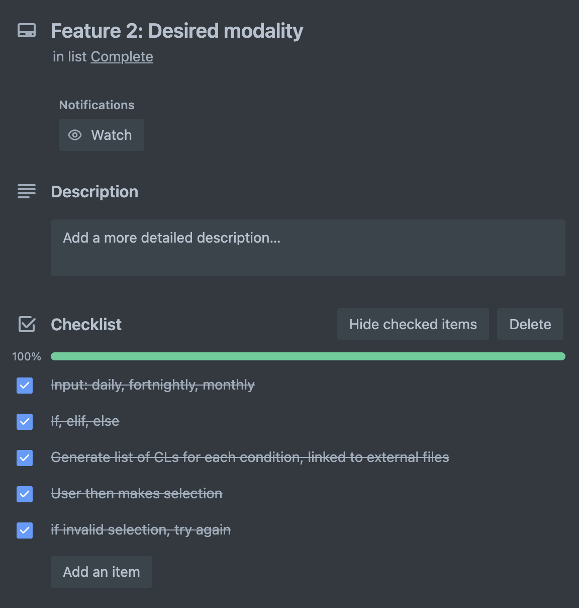
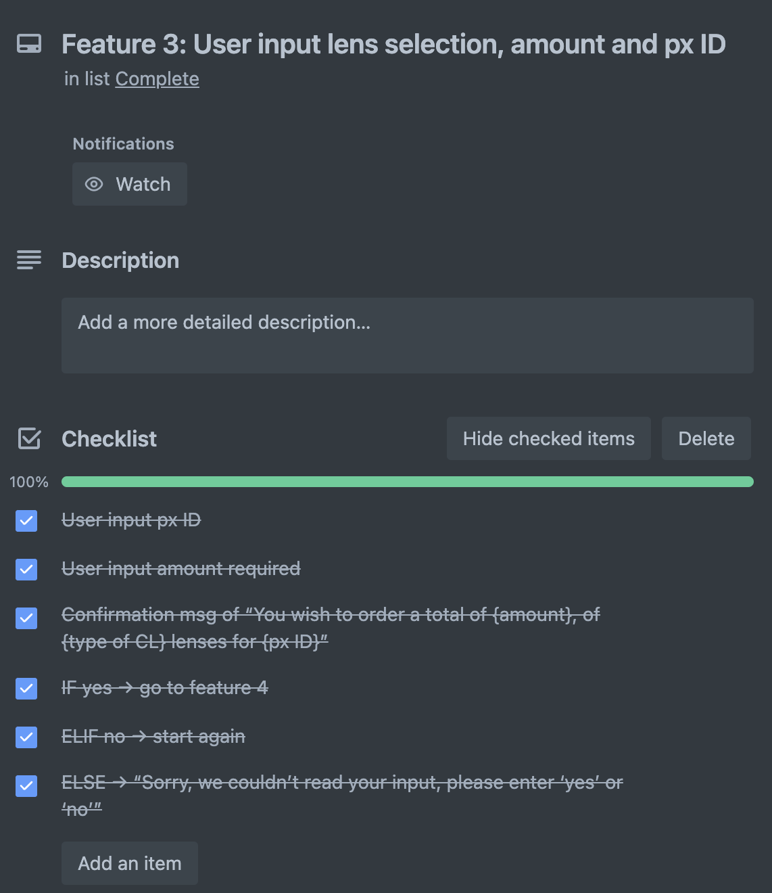
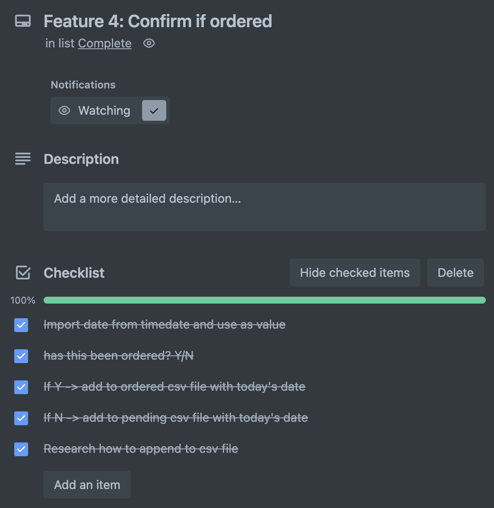
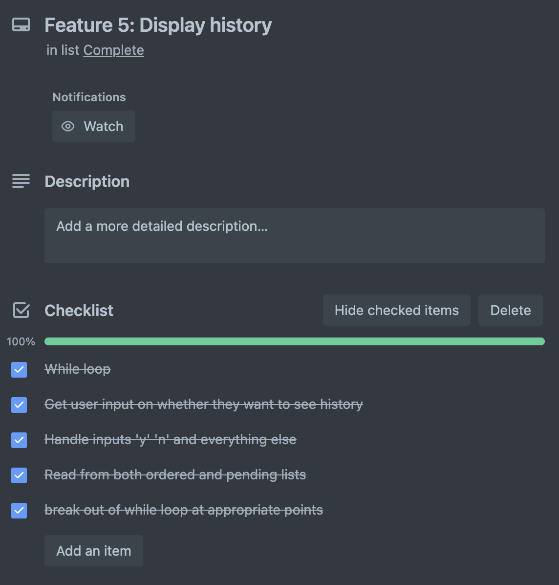
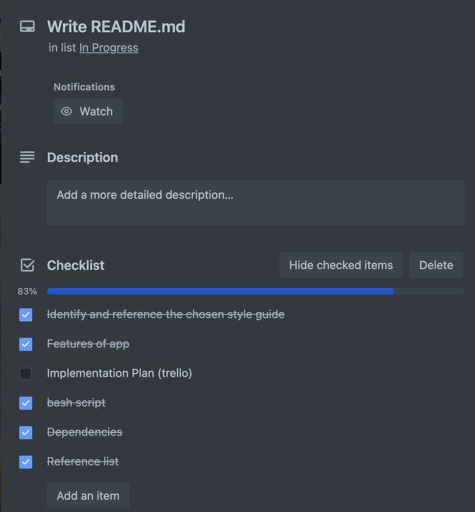

# T1A3 Terminal Application
## By Alicia Han

[Github Repository](https://github.com/ahan-nz/CA-T1A3-TerminalApplication)

[Video Presentation](https://youtu

[My Trello Board](https://trello.com/b/ZHAu8luF/ca-t1a3-terminal-app)

### Purpose and Key Features

This terminal application is designed to log and track contact lens orders, for use in optometric practices by optometrists and clinic staff. Often, the process of ordering contact lenses vary significantly from clinic to clinic, there is a lot of paper work, orders have to be made across several websites and there isn't a central digital system to monitor these orders. This makes it difficult not only for organisation and tracking within a busy clinic, but also for locum optometrists and dispensing staff working across multiple locations.

#### ***Feature 1: Prescription Converter***

A contact lens prescription calculator is coded in a file called 'contactrx.py'. It allows user to input the patient's spectacle prescription as well as the measured back vertex distance in clinic, in mm, and converts it to the correct contact lens prescription required. This saves time and minimises human error during a busy clinic. The result of the formula is rounded to the nearest 0.25 of a dioptre, as per optometry convention. The terminal then displays a message stating the contact lens prescription for the user.

#### ***Feature 2: Selecting Lens Modality***

The terminal will display a list of modalities available, i.e. daily, fortnightly and monthly. User input is required to select one of the three. Once a valid input is entered, the corresponding txt file containing the list of available lenses in the selected modality will print to terminal, with each lens on a new line for readability. The user is then prompted to enter their lens, either choosing from the list or entering a custom input for lenses that may not be included in the list, such as specialty lenses.

#### ***Feature 3: More Order Details***

The user will be prompted to enter patient ID, this comes down to clinic preference, for example the patient's ID number in the clinic's database or their surname and initials, etc. The user will also enter how many pairs of lenses are needed, only positive integers will be accepted. This will output into one confirmation message containing all the order details. User will enter 'y' to proceed with the rest of the programme, or 'n' to end programme and start again. More than 5 invalid inputs will also end the programme.

#### ***Feature 4: Adding Order to Correct File***

The user will be asked whether the lens order has already been placed. If yes, the order will be appended to an 'ordered.csv' file together with the current date. If no, these details will instead be appended to a 'pending.csv' file.

#### ***Feature 5: Display Order History***

The user will be prompted to enter whether they would like to display the order history. If yes, 'ordered.csv' and 'pending.csv' will be printed to terminal in dictionary form for readability. If no, the programme will end with a 'thank you' message.

### Implementation Plan

I utlised Trello to help me plan and implement this project. For each feature, I added a checklist to help me outline and track what I have completed and what I need to do next. More details were added and modifications were made during this process.

Snapshots of my progress:


Here are the checklists for each feature:








### Style Guide

This application in Python follows the PEP8 Style Guide (van Rossum, Warsaw and Coghlan, 2023). This includes, but isn't limited to, the following guidelines:
* 4 spaces per indentation level
* Maximum line length is 79 characters
* Imports on separate lines
* Using single-quoted strings consistently, except when an apostrophe appears in the string, in which case double-quotes were used to avoid backslashes, and hence improve readability
* Comments in complete sentences and the first word is capitalised. Also inline comments were avoided
* Function names are in lower case and words are separated by underscores to improve readability.

### Bash Script

```
#!/bin/bash
cd ./src
if [[ -x "$(command -v python)" ]]
then
    pyv="$(python -V 2>&1)"
    if [[ $pyv == "Python 3"* ]]
    then
        python3 -m venv .venv 
        source .venv/bin/activate
        pip3 install -r ./requirements.txt
        python3 main.py
    else
        echo "Please update your version of Python." >&2
    fi 
else
    echo 'Error: 
    This program runs on Python, but it looks like Python is not installed.
    To install Python, check out https://installpython3.com/' >&2
  exit 1
fi

```

### Dependencies

* iniconfig==2.0.0
* packaging==23.1
* pluggy==1.0.0
* pytest==7.3.1

### Imported Packages and Modules

* csv
* datetime
* sys
* pytest 
* unittest

### References

* van Rossum, G., Warsaw, B. and Coghlan, N. (2023). PEP 8 – Style Guide for Python Code | peps.python.org. [online] peps.python.org. Available at: https://peps.python.org/pep-0008/.

* www.gnu.org. (2022). Bash Reference Manual. [online] Available at: https://www.gnu.org/software/bash/manual/bash.html.

* Python Software Foundation (2023). csv — CSV File Reading and Writing — Python 3.8.1 documentation. [online] Python.org. Available at: https://docs.python.org/3/library/csv.html.

* Python Software Foundation (2023). Datetime — Basic Date and Time Types — Python 3.7.2 Documentation. [online] Python.org. Available at: https://docs.python.org/3/library/datetime.html.

* Python.org. (2023). sys — System-specific parameters and functions — Python 3.7.3 documentation. [online] Available at: https://docs.python.org/3/library/sys.html.

* Pytest (2015). Full pytest documentation — pytest documentation. [online] Available at: https://docs.pytest.org/en/7.1.x/contents.html.

* Python Software Foundation (2023). unittest — Unit testing framework — Python 3.8.2 documentation. [online] Available at: https://docs.python.org/3/library/unittest.html.